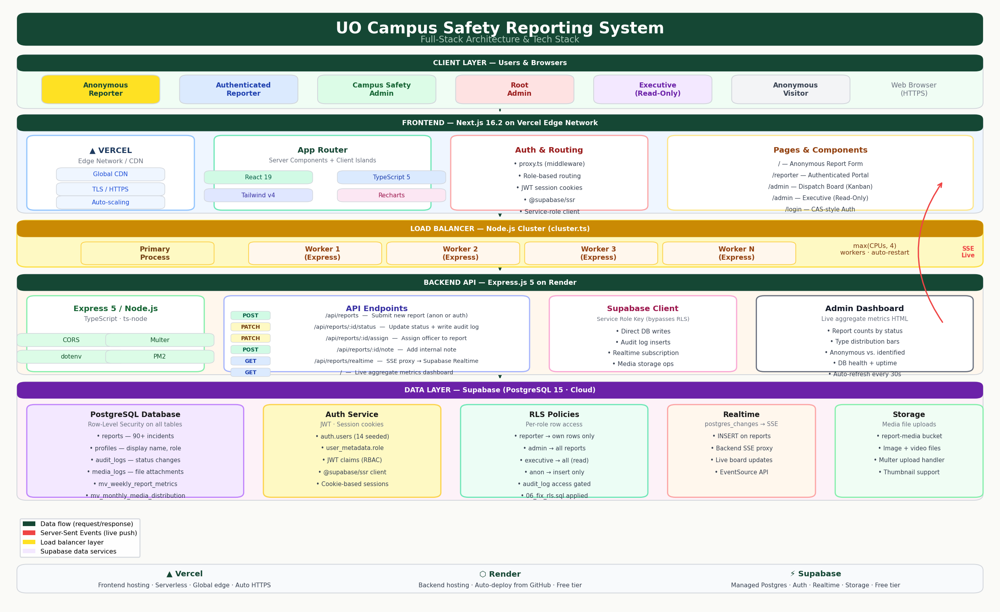

# UO Campus Safety Reporting System

A full-stack internal reporting and dispatch platform for University of Oregon Campus Safety. Built as a technical demonstration project — anonymous incident submission as the primary public flow, a real-time operational dispatch board for safety staff, and a read-only overview for executive stakeholders.



---

## Table of Contents

- [Overview](#overview)
- [Features](#features)
- [Tech Stack](#tech-stack)
- [Architecture](#architecture)
- [Project Structure](#project-structure)
- [Getting Started](#getting-started)
  - [Prerequisites](#prerequisites)
  - [Environment Variables](#environment-variables)
  - [Database Setup](#database-setup)
  - [Running Locally](#running-locally)
- [User Roles](#user-roles)
- [Key Features Deep Dive](#key-features-deep-dive)
  - [Dispatch Board (Kanban)](#dispatch-board-kanban)
  - [Priority System](#priority-system)
  - [Officer Dispatch](#officer-dispatch)
  - [Real-Time Updates](#real-time-updates)
  - [Load Balancer](#load-balancer)
- [Deployment](#deployment)
- [Database Schema](#database-schema)

---

## Overview

The system serves three distinct audiences from a single codebase:

| Audience | Experience |
|----------|------------|
| **General public / students** | Anonymous report submission at `/` — no account required |
| **Authenticated reporters** | Submit and track their own reports at `/reporter` |
| **Campus safety staff** | Real-time dispatch board at `/admin` — triage, assign, and resolve incidents |
| **Executive stakeholders** | Read-only analytics overlay on the same `/admin` board |

The design philosophy mirrors professional incident management tools (CAD/dispatch systems) while preserving the University of Oregon's visual identity — UO green, cream paper tones, and serif typography.

---

## Features

### Public
- **Anonymous reporting** — 10 incident types, optional contact info for follow-up, media attachment support
- **Authenticated reporting** — sign in to track submission history with live status updates

### Admin Dispatch Board
- **Kanban board** — three columns (Pending → Under Review → Closed), sorted by priority tier then age
- **Priority classification** — automatic P1 CRITICAL through P4 LOW based on incident type
- **OVERDUE alerts** — pulsing badge on any pending report older than 30 minutes
- **Officer assignment** — assign any admin to a report; officer roster strip shows active load per officer
- **Search, filter, sort** — filter by priority (multi-select), tag (multi-select), type, and free-text search; sort by priority, newest, or oldest
- **Auto-generated tags** — MEDICAL, EMS, FIRE, SUSPICIOUS, etc. derived from incident type
- **Suggested actions** — type-specific response guidance shown immediately in the detail panel
- **Detail panel** — slide-out with full reporter contact info, status controls, officer assignment, internal notes, and complete audit trail
- **Live SSE updates** — new reports appear on the board without a page refresh
- **Analytics** — type distribution, weekly volume by status, resolution rate over time

### Security & Access Control
- Role-based routing enforced at the middleware layer (`proxy.ts`)
- Row-Level Security on every Supabase table
- Executives see the full board but cannot change status, assign officers, add notes, or view reporter PII
- Service-role client used only server-side; anon key used in the browser

### Infrastructure
- Node.js cluster load balancer — up to 4 workers, auto-restart on crash
- PM2 cluster mode for production
- Materialized views for analytics query performance

---

## Tech Stack

| Layer | Technology |
|-------|-----------|
| **Frontend** | Next.js 16.2 (App Router), React 19, TypeScript 5 |
| **Styling** | Tailwind CSS v4 (`@theme inline` — no config file) |
| **Charts** | Recharts (isolated in `'use client'` components) |
| **Backend** | Express.js 5, Node.js, TypeScript |
| **Database** | Supabase (PostgreSQL 15) |
| **Auth** | Supabase Auth — JWT, cookie sessions via `@supabase/ssr` |
| **Realtime** | Supabase Realtime → Express SSE → browser EventSource |
| **Storage** | Supabase Storage (media attachments) |
| **Load balancer** | Node.js built-in `cluster` module |
| **Process manager** | PM2 (production) |
| **Frontend hosting** | Vercel (Edge Network) |
| **Backend hosting** | Render |

---

## Architecture

```
┌─────────────────────────────────────────────────────────────┐
│                        Browser (HTTPS)                       │
└────────────────────┬──────────────────────────┬─────────────┘
                     │ Next.js requests          │ API calls
                     ▼                           ▼
┌──────────────────────────┐      ┌──────────────────────────┐
│  Vercel Edge / Next.js   │      │   Render / Express.js    │
│                          │      │                          │
│  proxy.ts (middleware)   │      │  cluster.ts              │
│  ├─ JWT auth check       │      │  ├─ Primary process      │
│  ├─ Role-based routing   │      │  ├─ Worker 1 (Express)   │
│  └─ Session cookies      │      │  ├─ Worker 2 (Express)   │
│                          │      │  └─ Worker N (Express)   │
│  Server Components       │      │                          │
│  ├─ /admin page.tsx      │      │  Routes                  │
│  ├─ /reporter page.tsx   │      │  ├─ POST /api/reports    │
│  └─ API route handlers   │      │  ├─ PATCH .../status     │
│                          │      │  ├─ PATCH .../assign     │
│  Client Components       │      │  ├─ POST  .../note       │
│  ├─ AdminKanban          │      │  └─ GET   .../realtime   │
│  ├─ ReportDetailPanel    │      │         (SSE stream)     │
│  ├─ AdminClientShell     │──────┤                          │
│  └─ OfficerRoster        │ SSE  └──────────┬───────────────┘
└──────────────────────────┘                 │
                     │                       │  supabase-js
                     │ @supabase/ssr          │  service role
                     ▼                       ▼
          ┌─────────────────────────────────────────┐
          │              Supabase Cloud             │
          │                                         │
          │  PostgreSQL 15                          │
          │  ├─ reports (90+ rows, RLS)             │
          │  ├─ profiles (display name, role)       │
          │  ├─ audit_logs (status history)         │
          │  ├─ media_logs (attachments)            │
          │  └─ materialized views (analytics)      │
          │                                         │
          │  Auth · Realtime · Storage              │
          └─────────────────────────────────────────┘
```

**Data flow for a new incident:**
1. Visitor submits form on `/` → Next.js Server Action → `POST /api/reports` on Express
2. Express writes to Supabase (service role, bypasses RLS)
3. Supabase Realtime fires `INSERT` event → Express SSE stream
4. Admin board receives SSE message → React state update → new card appears in PENDING column

---

## Project Structure

```
/
├── frontend/                    # Next.js application (deployed to Vercel)
│   ├── src/
│   │   ├── app/
│   │   │   ├── page.tsx         # Homepage — anonymous report form
│   │   │   ├── AnonReportForm.tsx
│   │   │   ├── admin/           # Dispatch board (admin + executive)
│   │   │   │   ├── page.tsx         # Server component — data fetch
│   │   │   │   ├── AdminClientShell.tsx  # Client state boundary
│   │   │   │   ├── AdminKanban.tsx       # Kanban board (default view)
│   │   │   │   ├── AdminTable.tsx        # List view (search/filter)
│   │   │   │   ├── AdminTabs.tsx         # Board | List | Analytics tabs
│   │   │   │   ├── AdminOverview.tsx     # Stat cards strip
│   │   │   │   ├── AdminAnalytics.tsx    # Recharts visualizations
│   │   │   │   ├── OfficerRoster.tsx     # Officer dispatch strip
│   │   │   │   ├── ReportDetailPanel.tsx # Slide-out detail panel
│   │   │   │   └── types.ts             # Shared types + priority/tag/action helpers
│   │   │   ├── reporter/        # Authenticated reporter portal
│   │   │   ├── login/           # CAS-style login page
│   │   │   ├── executive/       # Redirects to /admin (read-only mode)
│   │   │   ├── api/
│   │   │   │   └── reports/[id]/audit/route.ts  # Audit log Route Handler
│   │   │   └── actions/auth.ts  # login/logout Server Actions
│   │   ├── lib/supabase/
│   │   │   └── server.ts        # createClient() + createServiceClient()
│   │   └── proxy.ts             # Auth middleware (role-based routing)
│   ├── .env.local               # Local env vars (gitignored)
│   ├── .npmrc                   # legacy-peer-deps=true
│   └── vercel.json
│
├── backend/                     # Express API (deployed to Render)
│   ├── src/
│   │   ├── cluster.ts           # Load balancer (Node.js cluster)
│   │   ├── index.ts             # Express app + all routes
│   │   ├── dashboard.ts         # Metrics dashboard HTML
│   │   └── lib/supabase.ts      # Supabase service-role client
│   ├── ecosystem.config.js      # PM2 cluster config
│   └── tsconfig.json
│
├── supabase/
│   └── migrations/
│       ├── 01_schema.sql
│       ├── 02_schema_expansion.sql
│       ├── 03_anonymous_and_types.sql
│       ├── 04_seed.sql           # 14 auth users + 25 reports
│       ├── 05_more_seed.sql      # 65 reports across 30 days
│       ├── 06_fix_rls.sql        # Fix JWT role claim in policies
│       └── 07_officer_assignment.sql
│
├── tech_stack_diagram.py        # Generates tech_stack_diagram.png
├── tech_stack_diagram.png       # Architecture diagram
├── LOGINS.md                    # Credentials + interviewer guide (gitignored)
└── README.md
```

---

## Getting Started

### Prerequisites

- Node.js 20+
- Python 3.10+ with `matplotlib` (`pip3 install matplotlib`)
- A [Supabase](https://supabase.com) project (free tier works)
- [Vercel CLI](https://vercel.com/docs/cli) (optional, for local preview)

### Environment Variables

**Frontend** — create `frontend/.env.local`:

```env
NEXT_PUBLIC_SUPABASE_URL=https://your-project.supabase.co
NEXT_PUBLIC_SUPABASE_ANON_KEY=your-anon-key
SUPABASE_SERVICE_ROLE_KEY=your-service-role-key
NEXT_PUBLIC_BACKEND_URL=http://localhost:3001
```

**Backend** — create `backend/.env`:

```env
SUPABASE_URL=https://your-project.supabase.co
SUPABASE_SERVICE_KEY=your-service-role-key
PORT=3001
```

> The service role key is safe to use server-side only. Never prefix it with `NEXT_PUBLIC_`.

### Database Setup

Run the migrations in order in your Supabase SQL Editor:

```
supabase/migrations/01_schema.sql
supabase/migrations/02_schema_expansion.sql
supabase/migrations/03_anonymous_and_types.sql
supabase/migrations/04_seed.sql
supabase/migrations/05_more_seed.sql
supabase/migrations/06_fix_rls.sql
supabase/migrations/07_officer_assignment.sql
```

After running `05_more_seed.sql`, refresh the materialized views:

```sql
REFRESH MATERIALIZED VIEW public.mv_weekly_report_metrics;
REFRESH MATERIALIZED VIEW public.mv_monthly_media_distribution;
```

### Running Locally

**Terminal 1 — Backend:**
```bash
cd backend
npm install
npm run dev          # nodemon watches src/index.ts
```

**Terminal 2 — Frontend:**
```bash
cd frontend
npm install
npm run dev          # Next.js dev server on :3000
```

The frontend proxies API calls to `localhost:3001` via `NEXT_PUBLIC_BACKEND_URL`.

To regenerate the tech stack diagram:
```bash
python3 tech_stack_diagram.py
```

---

## User Roles

| Role | Access | Notes |
|------|--------|-------|
| **Anonymous** | `/` — report form | No account required; `user_id` is null in DB |
| **Reporter** | `/reporter` | Sees only their own submissions; status updates in real time |
| **Admin** | `/admin` | Full dispatch board — triage, assign, resolve, add notes |
| **Root Admin** | `/admin` + ROOT badge | Same as admin; accessed via footer `SYSTEM` link |
| **Executive** | `/admin` + READ ONLY badge | Board + analytics; no PII, no status changes, no officer assignment |

Role is stored in `auth.users.raw_user_meta_data.role` and read via `user.user_metadata.role` in the application. RLS policies use `auth.jwt()->'user_metadata'->>'role'` for database-level enforcement.

---

## Key Features Deep Dive

### Dispatch Board (Kanban)

The admin landing view is a three-column kanban board rather than a table. This matches the mental model of incident management — work items in flux, not rows in a spreadsheet.

**Columns:**
- **PENDING** — red top border, P1 count badge, oldest-first within priority
- **UNDER REVIEW** — blue top border
- **CLOSED** — green top border (resolved + dismissed combined)

**Cards are sorted:** priority ascending (P1 first), then oldest-first within the same priority tier. This ensures the most critical, longest-waiting incidents are always at the top of their column.

**Filter toolbar:**
- Full-text search across description, type, and contact name
- Type dropdown
- Priority multi-select pills (P1 / P2 / P3 / P4)
- Tag multi-select pills (auto-derived from the current report set)
- Sort: Priority | Newest | Oldest

### Priority System

Priority is derived automatically from incident type — no manual classification required.

| Priority | Types | Indicator |
|----------|-------|-----------|
| **P1 CRITICAL** | Fire Hazard, Medical Emergency | Red left border + badge |
| **P2 HIGH** | Suspicious Activity, Harassment | Orange left border + badge |
| **P3 MODERATE** | Theft, Vandalism, Incident, Hazard | Amber left border + badge |
| **P4 LOW** | Noise Complaint, Maintenance, Other | Blue left border + badge |

Each type also carries auto-generated **tags** (e.g. `MEDICAL · EMS · 911`) and a **suggested action** string displayed in the detail panel.

Reports pending for more than 30 minutes receive an animated **OVERDUE** badge. The overview strip shows a dedicated "Overdue" counter card (colored red if non-zero).

### Officer Dispatch

The **Officer Roster** strip sits between the overview metrics and the kanban board. It lists every admin-role user with their current active case count or "Available" status.

- Click an officer's chip → the kanban filters to show only their assigned reports
- Click again → clears the filter
- In the detail panel, an **Assigned Officer** dropdown lets you assign or reassign any open report to any officer in the roster
- Assignment is stored in `reports.assigned_to` (UUID FK to `auth.users`)
- The kanban card footer shows the assigned officer's name in UO green, or "Unassigned" in gray

### Real-Time Updates

New reports submitted via the public form appear on the admin board without a page refresh.

**Flow:**
1. Express backend subscribes to Supabase Realtime `postgres_changes` on the `reports` table
2. On `INSERT`, Express writes to the open SSE stream (`GET /api/reports/realtime`)
3. The browser `EventSource` in `AdminClientShell` receives the event
4. React state is updated — a new card prepends to the PENDING column

### Load Balancer

`backend/src/cluster.ts` uses Node.js's built-in `cluster` module to fork up to `min(CPU count, 4)` worker processes. All workers listen on the same port; the OS distributes incoming connections via round-robin.

- **Zero extra dependencies** — `node:cluster` is built in
- **Automatic recovery** — the primary process forks a replacement whenever a worker exits
- **PM2 integration** — `ecosystem.config.js` sets `exec_mode: 'cluster'` and `instances: 'max'` for production, giving PM2 control over worker lifecycle

```
Primary (cluster.ts)
  ├─── Worker 1 → Express app (port 3001)
  ├─── Worker 2 → Express app (port 3001)
  ├─── Worker 3 → Express app (port 3001)
  └─── Worker N → Express app (port 3001)
          ↑
          OS round-robin load distribution
```

---

## Deployment

### Frontend → Vercel

1. Push the repo to GitHub
2. Import the project in Vercel
3. Set **Root Directory** to `frontend`
4. Add environment variables (all four listed above)
5. Deploy — Vercel detects Next.js automatically

### Backend → Render

1. Create a new **Web Service** in Render, connected to the GitHub repo
2. Set **Root Directory** to `backend`
3. Build command: `npm install && npm run build`
4. Start command: `node dist/cluster.js`
5. Add environment variables (`SUPABASE_URL`, `SUPABASE_SERVICE_KEY`, `PORT`)

---

## Database Schema

```sql
-- Core tables
reports (
  id            UUID PRIMARY KEY,
  type          report_type,          -- enum: noise_complaint | medical_emergency | ...
  status        report_status,        -- enum: pending | under_review | resolved | dismissed
  description   TEXT,
  is_anonymous  BOOLEAN,
  contact_name  TEXT,
  contact_email TEXT,
  user_id       UUID → auth.users,
  assigned_to   UUID → auth.users,    -- officer assignment
  created_at    TIMESTAMPTZ
)

profiles (
  id            UUID → auth.users PRIMARY KEY,
  display_name  TEXT,
  role          TEXT                  -- reporter | admin | root_admin | executive
)

audit_logs (
  id            UUID PRIMARY KEY,
  report_id     UUID → reports,
  changed_by    UUID → auth.users,
  old_status    report_status,
  new_status    report_status,
  note          TEXT,
  created_at    TIMESTAMPTZ
)

-- Materialized views (must be manually refreshed after bulk inserts)
mv_weekly_report_metrics  (report_week, status, total_reports)
mv_monthly_media_distribution
```

RLS is enabled on all tables. The service-role key (backend + server-side Next.js) bypasses RLS for administrative operations. The anon key (browser client) is fully RLS-gated.
